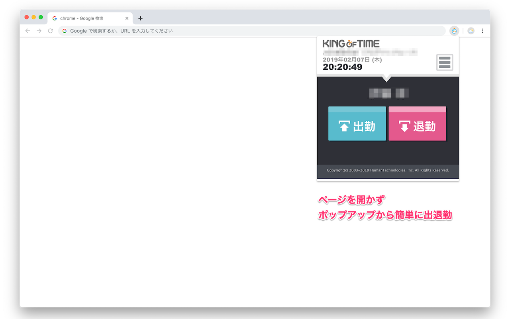
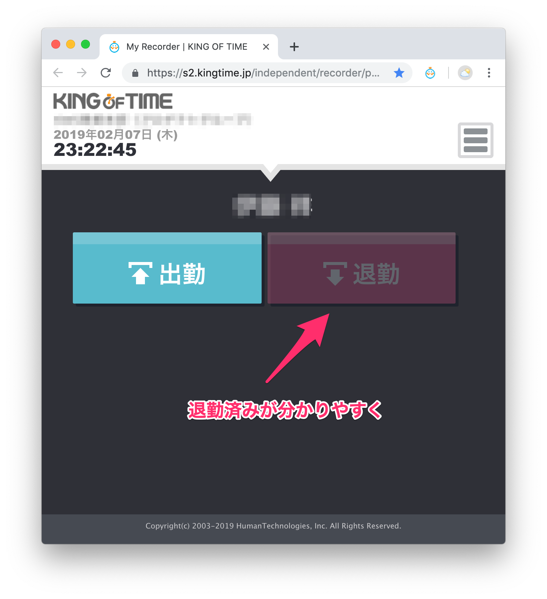

# MyレコーダーChromeアシスタント

Chromeウェブストア - MyレコーダーChromeアシスタント・ページ
https://chrome.google.com/webstore/detail/pifbdpooppfkllaiobkaoeocbfmpabaj/

勤怠管理システム「[Myレコーダー | KING OF TIME](https://kingoftime.jp/record/myrecorder/)」を快適に使えるようにするためのChrome拡張です。

## ブラウザの専用ボタンからポップアップ表示
ブックマークからMyレコーダーページを開くことすら面倒な人向けに、ポップアップ表示して、素早く出勤や退勤できるようにします。

## Myレコーダーページの出勤、退勤ボタンの表示アシスト
次のアクションを分かりやすくして、2重に出勤や退勤をしてしまう誤操作を予防します。

## 出勤、退勤時のSlackメッセージ通知
設定したSlackチャンネルに対して、以下のようなメッセージが送られるようにできます。  
メッセージやチャンネルはカスタマイズ可能です。

- 出勤ボタン押下時に「出社しました。」
- 退勤ボタン押下時に「退社します。」

## 出勤、退勤時のSlackステータス変更
設定したステータス絵文字やステータステキストで、以下のようなステータスに変更できます。  
ステータス絵文字やステータステキストはカスタマイズ可能です。

- 出勤ボタン押下時に「:office: 仕事中」
- 退勤ボタン押下時に「:house: プライベートタイム」

## Contributors ✨

<!-- ALL-CONTRIBUTORS-LIST:START - Do not remove or modify this section -->
<!-- prettier-ignore-start -->
<!-- markdownlint-disable -->
<table>
  <tbody>
    <tr>
      <td align="center" valign="top" width="14.28%"><a href="https://github.com/shoito"> <b>shoito</b></a> <a href="https://github.com/shoito/kot-chrome-assistant/commits?author=shoito" title="Documentation">📖</a> <a href="#business-shoito" title="Business development">💼</a> <a href="https://github.com/shoito/kot-chrome-assistant/commits?author=shoito" title="Code">💻</a> <a href="#design-shoito" title="Design">🎨</a> <a href="#ideas-shoito" title="Ideas, Planning, & Feedback">🤔</a></td>
      <td align="center" valign="top" width="14.28%"><a href="https://cti1650-portfolio-site.vercel.app/"> <b>cti1650</b></a> <a href="https://github.com/shoito/kot-chrome-assistant/commits?author=cti1650" title="Code">💻</a></td>
      <td align="center" valign="top" width="14.28%"><a href="https://github.com/hirobel"> <b>Hiroaki Katoo</b></a> <a href="https://github.com/shoito/kot-chrome-assistant/commits?author=hirobel" title="Code">💻</a></td>
      <td align="center" valign="top" width="14.28%"><a href="https://github.com/ueki-kazuki"> <b>Kazuki Ueki</b></a> <a href="https://github.com/shoito/kot-chrome-assistant/commits?author=ueki-kazuki" title="Code">💻</a></td>
    </tr>
  </tbody>
</table>

<!-- markdownlint-restore -->
<!-- prettier-ignore-end -->

<!-- ALL-CONTRIBUTORS-LIST:END -->
